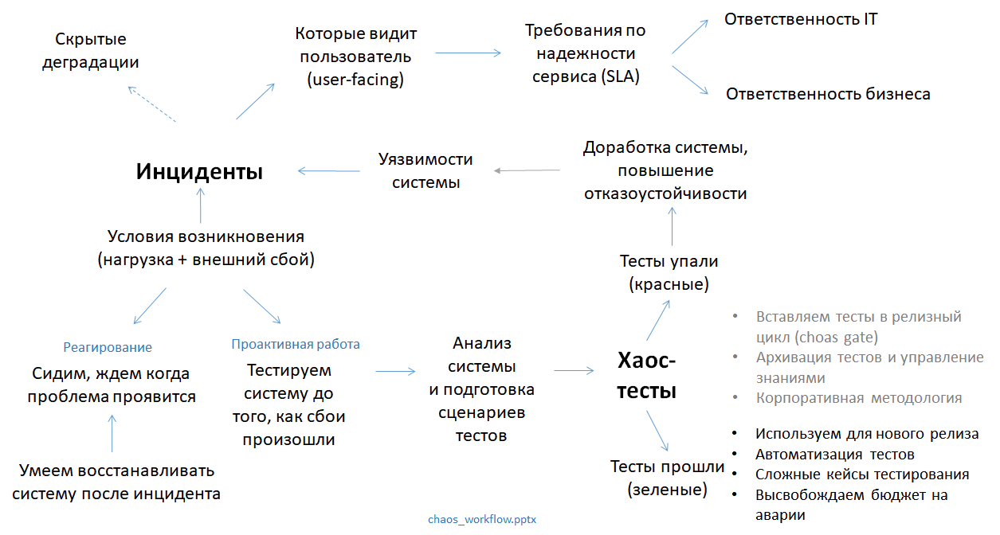

# Цикл работы с хаос-тестами

2020-09-07

На эскизном рисунке ниже мы показываем цикл работы с хаос тестами
внутри организации: 

- бизнес и ИТ отвечают за SLA в области надежности, 
- есть история инцидентов,
- уже внедрено реагирование на инциденты, есть мониторинг и восстановление системы,
- хаос-тесты дают положительные и отрицательные результаты:
  - зеленые тесты переиспользуются в следующем релизе, снижают рисковый бюджет,
  - красные тесты анализируются, выставляются их проиоритеты, идут тасками в разработку.

Вопросы:

1. Что на этой схеме главное?
2. Что излишне детализировано?
3. Чего не хватает?

(Материал дополняется.)