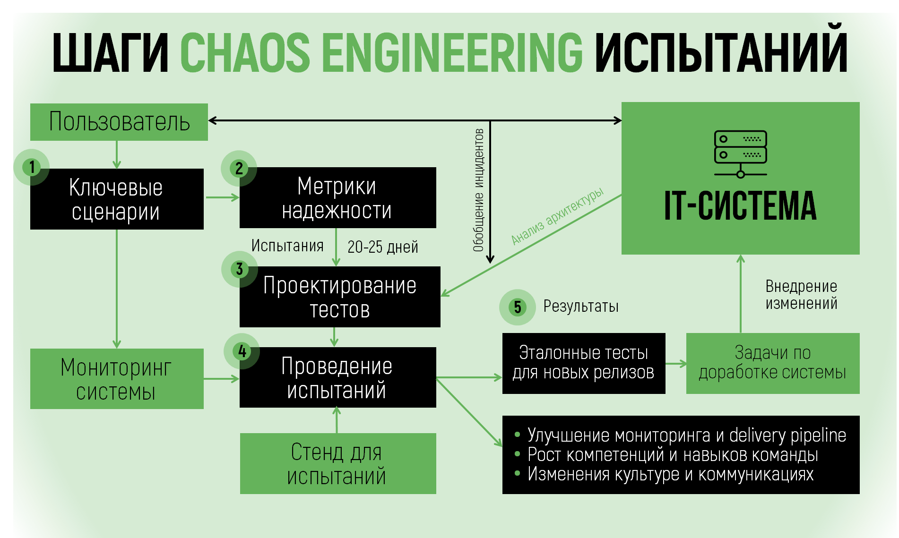

<!--  Повышение надежности и отказоустойчивости ИТ-систем -->

# Тестирование надежности

Мы предлагаем услуги по тестированию и верификации надежности и отказоустойчивости ИТ-систем. 
Это тестирование необходимо при доработке крупных, распределенных систем, работа которых должны быть защищена от сбоев инфраструктуры и сторонних приложений.

### Методология

На этой странице мы рассказываем о применяемой нами методологии хаос-тестирования (chaos engineering). С помощью хаос-тестов мы можем показать уязвимость системы как к типовым, так и к редким, но дорогостоящим сценариям сбоев. Эти же тесты покажут, что уязвимости устранены разработчиками.

Хаос-тесты обычно проводятся для систем, которые уже прошли другие виды тестирования 
(например, нагрузочное или стресс-тестирование), но в стадии эксплуатации копят историю инцидентов и требуют доработки отказоустойчивости. Хаос-тесты могут встраиваться в релизный цикл и подтверждать надежность системы против ранее выявленных или потенциальных сценариев сбоев.

Хаос-тесты также используются для повышения квалификации команды эксплуатации 
путем разбора инцидентов, показанных на тестовом кластере, доработки систем мониторинга, 
изменения настроек и конфигурации систем, автоматизации процедур экплуатации.

### Chaos engineering: придумал Netflix – применяем мы

В 2010 году Netflix стал пионером хаос-тестирования (chaos engineering). Контролируемое внедрение ограниченных сетевых и аппаратных ошибок в работающие системы позволило Netflix выявить слабые стороны своих сервисов и предотвратить будущие сбои. Удачный опыт стал стандартной практикой разработки и эксплуатации крупных распределенных систем. Сhaos engineering внедряется в традиционном ритейле (Walmart), электронной коммерции (Alibaba), банках (Capital One). Цель внедрения - снизить прямые и скрытые издержки, связанные со сбоями или деградациями ИТ-систем, которые выражаются в деньгах, репутации, оттоке клиентов. 

###  Кто сможет внедрить?

Компании, которые разрабатывают и эксплуатируют высоконагруженные IT-системы и хотят обеспечить более высокий уровень надежности своих пользовательских и служебных сервисов и готовы заимствовать с рынка лучшие практики работы.

Спрос на хаос-тестирование растет по мере усложнения IT-систем, перехода от монолитных к микросервисным архитектурам и миграции в облачные сервисы. Дополнительными мотивами для внедрения хаос-тестирования также являются:

- потребность в обеспечении совместной работы многочисленных систем и сервисов внутри организации, исключение ошибок на границах ответственности,
- необходимость повысить качество собственных и заказных разработок через требования к программному обеспечению и инфраструктуре, 
- верификация работ, выполненных в сфере непрерывности бизнеса (business continuity / disaster recovery) и управления операционными рисками,
- обучение персонала команды эксплуатации на реальных контролируемых инцидентах.

### Наши предложения

Наша базовая услуга - подготовка и проведение испытаний надежности автоматизированной системы (АС) с контролируемым внесением сбоев инфраструктурного уровня и уровня приложений ("хаос-испытание").  Услуга включает в себя: 

- анализ пользовательских сценариев, архитектуры и истории инцидентов на АС;
- определение точек отказа, подготовка тестовых кейсов и сценариев тестирования;
- анализ тестового кластера, предоставленного заказчиком, и установка ПО, необходимого для испытаний;
- проведение самих испытаний и регистрацию их результатов;
- подготовку отчета о результатах тестирования.

Цикл такой услуги на показан на рисунке ниже.

По результатам тестирования обычно необходима доработка отказоустойчивости 
системы, которую обычно ведет команда клиента, но также может быть поручена
нам или нашим парнерам.

Помимо испытаний конкретных АС мы занимаемся автоматизацией хаос-тестов, созданием chaos gate для повышения качества разработки и включением тестов в релизный цикл. Для 
компаний, уже освоивших проведение хаос-тестах на отдельных системах, мы можем 
предложить разработки и обоснование корпоративной методологии хаос-тестирования.

Мы ведем подбор персонала в области разработки и эксплуатации ИТ-систем,
и обучение по вопросам обеспечения надежности и отказоустойчивости как на стадии 
разработки, так и на стадии эксплуатации.

  [Связаться с нами](contacts.md){: .md-button }

  
